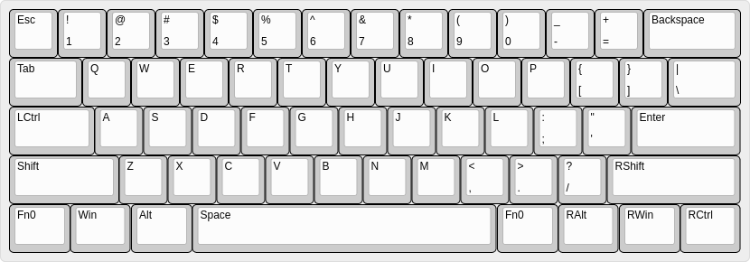
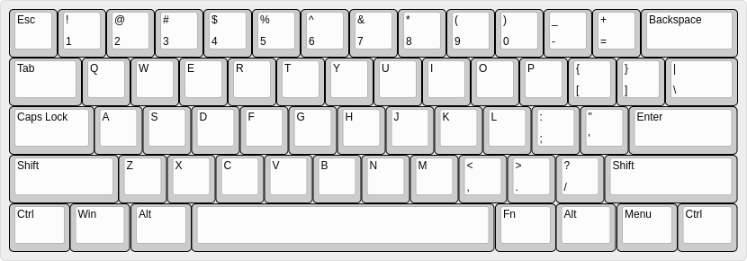

# Layout

## 布局定义

Layer 0:

[JSON (Raw)](layouts/layer-0_raw.json)

Layer 1:

[JSON (Raw)](layouts/layer-1_raw.json)

### Fn's

| Fn           | 作用                                  |
| ------------ | -------------                         |
| Fn0          | 瞬时开启第1层                         |
| Fn1          | 开关背光                              |
| Fn2          | 背光减档                              |
| Fn3          | 背光增档                              |
| Fn9          | Tricky Esc (Fn9 = Esc, Shift+Fn9 = ~) |

## 核心设计哲学

### 参考：原始布局

下文中：
1. `@`前缀表示按键在设定后的位置(Layer 0)。
1. `'@`表示按键在原始布局中的位置
1. `!`前缀表示击键策略；`L`表示左手；`R`表示右手；`1`~`5`表示大拇指到右手小指，`6`表示小指掌指关节处；`|`表示或者；连续不换手按键可以不多次注明手的代码，比如`!L12`表示先按下左手拇指再按下左手食指；`>`表示按栈结构释放；`<`表示按队列释放；中括号表示具体位置的按键，`手指代码[键位代码]`表示使用某个手指敲击某个按键。组合表示的示例：`!L5[@LCtrl]2[@F]>>`表示依次进行以下动作：使用左手小指按下LCtrl、使用左手食指按下F、释放左手食指、释放左手小指。

### @LCtrl = '@CapsLock

很多程序猿，尤其是Emacs用户会做此设定，理由在于Caps Lock极少用到，而Ctrl的作用则重要得多。'@CapsLock一个很容易由左手小指按到的位置，并且不会限制其他手指的发挥，使LCtrl的组合键可以轻而易举地击打出来，比如：

1. LCtrl+C: `!L52`；LCtrl+X: `!L53`；LCtrl+Z: `!L54`。
1. Ctrl+Shift+T: `!L5R5L2`或`L5[@LShift]4[@LCtrl]2[T]`

这个设定使得LCtrl变得异常顺手，而RCtrl处在右下角最远的位置，几乎没有使用的机会。

### @CapsLock = [@Fn0][@Tab]

Caps Lock不论使用哪个按键都显得浪费（'@RCtrl似乎是个不错的选择？），使用组合键一点都不为过。这个组合键敲出来也毫不费力：`!L6[@LFn0]5[@Tab]`或`!L1[@LFn0](3|4)[@Tab]`

### @Fn0 = '@LCtrl

在60%键盘尤其是可编程键盘中，Fn的意义远远大于75%或标准大小的键盘，所有的功能键、Home、Delete之类特殊按键都需要使用Fn组合键来实现，因此，Fn也必须放置在一个易于击打的位置。

Emacs用户也大都听说过手掌按LCtrl的方法，相比LCtrl放在'@CapsLock而言，LCtrl+C, LCtrl+X之类的按键变得不那么方便，然而，用'@LCtrl作为Fn键实在是再合适不过了，因为Fn与哪些键能够组合完全是由我自己决定的。

### LFn与RFn

和Ctrl、Shift等一样，如果左手侧有被组合的按键，那么最好在右手侧设定一个Fn来分摊左手压力。

如果按照左右对称的原则来设计，那么@RFn0='@Menu，之所以没有这么做，一是因为它通常只用于与左手按键的组合，比如Up: [@RFn][@W]、Down: [@Rfn][@S]，二是因为它右边还有RCtrl，使用`!R6`的时候易误触，三是当前的@RFn='@RFn，而使用`!R4[@RFn]`并不吃力。

### Esc

在60%键盘上，Esc一般被放在'@\`，这是个非常神奇的位置，对于Vim用户来说，Esc一下变得非常顺手：`!L(4|3)`即可。

而反引号（\`）并不常用，因此使用[@Fn][@Esc]变得自然而然。

另外，tkg.io中包含了Tricky Esc功能，使得输入`~`只需[@Shift][@Esc]，而不需要再使用Fn。

