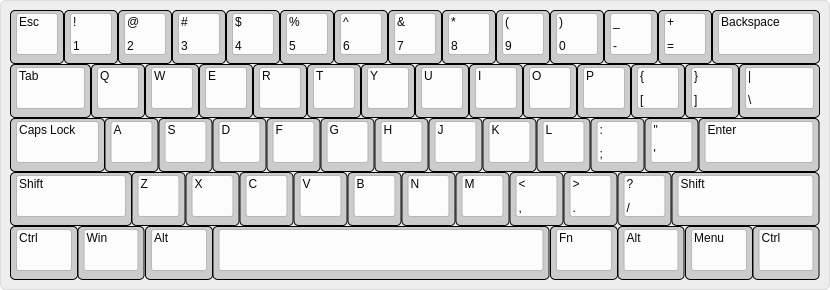

Finger Action Description Language
---

### 参考：原始布局

### 语法

1. `@`前缀表示按键在设定后的位置(Layer 0)。
1. `'@`表示按键在原始布局中的位置
1. `!`前缀表示击键策略；`L`表示左手；`R`表示右手；`1`~`5`表示大拇指到右手小指，`6`表示小指掌指关节处；`|`表示或者；连续不换手按键可以不多次注明手的代码，比如`!L12`表示先按下左手拇指再按下左手食指；`>`表示按栈结构释放；`<`表示按队列释放；中括号表示具体位置的按键，`手指代码[键位代码]`表示使用某个手指敲击某个按键。组合表示的示例：`!L5[@LCtrl]2[@F]>>`表示依次进行以下动作：使用左手小指按下LCtrl、使用左手食指按下F、释放左手食指、释放左手小指。
