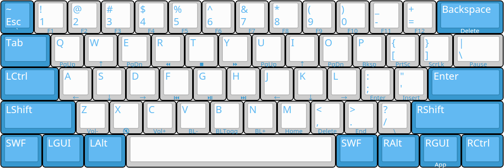
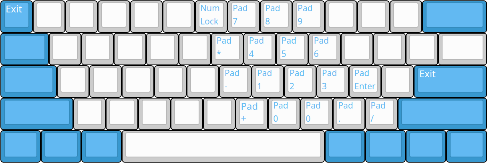

# 清和 5.0 (Seiwa-5.0) 固件手册

## 特性

* 人体工学按键映射，尤其适合程序狗
* 小键盘
* 午休模式
* 多媒体键（音量大小、静音、播放控制）
* Vim/Emacs模式切换
* [4.0新增] Dvorak键盘布局支持
* [5.0 新增] Seiwa Duo双手并击的实验支持


## 关于布局层

布局层分为三种：基本层和特殊层和管理员 (ZZ)。

* 基本层

  指用于基本输入的层。同时有且只有一个基本层处于激活状态。所有按键都有切实的定义，在QMK中没有任何按键透传到其他层。
  
  目前基本层包括：QWERTY、Dvorak、午休。
  
* 特殊层

  目前包括控制层和小键盘层。特殊层建立于基本层之上，每个基本层都有其专属的特殊层。
  
* 管理员 (ZZ)

  管理员是一种特殊的基本层，用于进行管理员操作，如切换基本层，切换Vim/Emacs模式，保存用户配置到EEPROM等。


### 基本层切换

1. 进入ZZ层（参见[管理员 (ZZ)](#管理员%20(ZZ))）。
1. 按下目的层序号对应的数字键。
1. 退出ZZ层。


### 进入控制层

目前包括控制层的基本层有QWERTY和Dvorak。

进入控制层的方法为，在处于基本层的状态时按住SWF键。

退出控制层的方法为，在处于控制层时松开SWF键。

控制层对应的按键在图片中以按键侧面的小字标注。


### 进入小键盘层

目前包括小键盘层的基本层有QWERTY和Dvorak。

临时进入小键盘层的方法为，在处于特殊层的状态时按住Space键，也相当于在处于基本层的状态时先按住SWF键，再按住Space键。

长期进入小键盘层的方法为，在处于特殊层的状态时按住Space键，再按下Enter键并松开。

从长期进入的小键盘层退出的方法为：按下Esc键或Enter键。


### QWERTY (序号为1）

QWERTY为默认基本层。当EEPROM为空时初次启动时会自动启动QWERTY层。

QWERTY的键位设置参考[维基词条](https://en.wikipedia.org/wiki/QWERTY)。




#### QWERTY控制层

参见上图按键侧面小字标注。


#### QWERTY小键盘层




### Dvorak（序号为2）

Dvorak的键位设置参考[维基词条](https://en.wikipedia.org/wiki/Dvorak_keyboard_layout)。

(TODO: 添加图片)


#### Dvorak控制层

参见上图按键侧面小字标注。


#### Dvorak小键盘层


### Duo 层（序号为3）

Duo层是一种双手并击的实验布局。原理为：将键盘分为左右两半，每只手使用15个按键即可独立完成单个字符的输入*。
左手与右手基本对称。

\* 目前通过这15个按键仅能输入26个英文字母以及","、"."、";"、"/"四个字符及其上档字符。其他字符仍处于原有位置。

当前的布局思路为：元音字母参照Dvorak布局排布于中间行：左右自`A`到`G`分别为`A` `O` `E` `U` `I`，右手自`H`到`;`分别为`I` `U` `E` `O` `A`。辅音字母按出现频率与击键舒适程度对应。击键舒适程度的定义由本人说了算。

除15个仅需单个按键输入的字符外，部分字符需要同时按下两个按键进行输入，如输入`G`，左手为同时按下`CD`，右手为同时按下`KM`。

完整的键值映射表如下：


#### 左手

|按键|对应键值||对应键值|按键|
|--|--|--|--|--|
|Q|H||A|A|
|W|R||B|AF|
|E|N||C|T|
|R|S||D|V|
|T|C||E|D|
|A|A||F|B|
|S|O||G|DC|
|D|E||H|Q|
|F|I||I|F|
|G|U||J|RA|
|Z|M||K|AG|
|X|L||L|X|
|C|T||M|Z|
|V|D||N|E|
|B|F||O|S|
|DF|Y||P|SC|
|SD|W||Q|AV|
|DC|G||R|W|
|SC|P||S|R|
|AF|B||T|C|
|EA|V||U|G|
|AG|K||V|EA|
|AC|X||W|SD|
|AV|Q||X|AC|
|RA|J||Y|DF|
|TA|Z||Z|TA|
|CV|,||,|CV|
|XC|.||.|XC|
|XV|;||;|XV|
|ZV|/||/|ZV|


#### 右手

|按键|对应键值||对应键值|按键|
|--|--|--|--|--|
|P|H||A|;|
|O|R||B|J;|
|I|N||C|Y|
|U|S||D|M|
|Y|C||E|K|
|;|A||F|N|
|L|O||G|KM|
|K|E||H|P|
|J|I||I|J|
|H|U||J|U;|
|/|M||K|H;|
|.|L||L|.|
|,|T||M|/|
|M|D||N|I|
|N|F||O|L|
|JK|Y||P|LM|
|KL|W||Q|;N|
|KM|G||R|O|
|LM|P||S|U|
|J;|B||T|,|
|I;|V||U|H|
|H;|K||V|I;|
|;M|X||W|KL|
|;N|Q||X|;M|
|U;|J||Y|JK|
|Y;|Z||Z|Y;|
|M,|,||,|M,|
|,.|.||.|,.|
|M.|;||;|M.|
|M/|/||/|M/|


#### 例句

This is only the beginning.

```
左手：T(C)  I(F)       I(F)       O(S)  L(X)       T(C)  E(D)  B(AF)  G(DC)  N(E)  I(F)  G(DC)
右手：   H(P)  S(U) 空格  S(U) 空格   N(I)  Y(JK) 空格  H(P)  空格   E(K)   I(J)  N(I)  N(I)
```

Duo层的控制层与小键盘层的进入方法以及映射与QWERTY完全一致。


### 午休（序号为0）

午休是一种特殊的基本层，用于防止趴在键盘上睡觉时出现误操作。

在午休层中无法进行任何输入操作，仅可切换到ZZ层（参见[基本层切换](#基本层切换)）。

午休层不包含特殊层。


## 管理员 (ZZ)

进入ZZ层的方法为：同时按住两个SWF键，再按下Enter键。

在ZZ层中可以进行如下操作：

* 切换基本层

  按下基本层对应的数字键。切换后别忘了退出ZZ。
  
* 切换Vim/Emacs模式

  按下Q键切换。

* 键盘复位

  按下Backspace键可以复位键盘。具体复位逻辑请参见QMK文档中关于RESET keycode的说明。

* 保存用户配置

  按下S键保存用户配置。

  用户配置目前包括以下内容：

  1. 当前基本层
  1. 当前Vim/Emacs模式

  每次上电时键盘会加载用户配置。
  
* 退出

  按Esc键退出ZZ层。
  

## Vim/Emacs模式切换

Seiwa中提供了切换Vim/Emacs模式的方法。两种模式的区别仅在于Esc键的行为：

* Vim模式（默认模式）

  Esc键默认为Esc，SWF+Esc为反引号 (`)，Shift+Esc为波浪号 (~)。
  
* Emacs模式

  Esc键默认为反引号 (`)，SWF+Esc为Esc，Shift+Esc为波浪号 (~)。

参见下图：


切换模式的方法为：

1. 进入ZZ层
1. 按下Q键
1. 退出ZZ层

模式切换适用于QWERTY/Dvorak。
