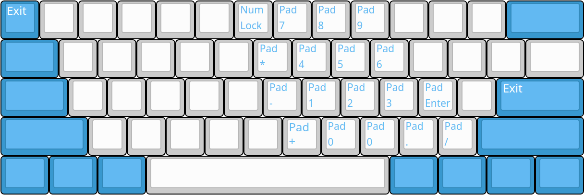

# 清和 (Seiwa) 固件手册

## 特性

* 人体工学按键映射，尤其适合程序狗
* 小键盘
* 午休模式
* 多媒体键（音量大小、静音、播放控制）
* Vim/Emacs模式切换

## 模式

模式分为Vim/Emacs两种，每种包括基本层、SWF层以及小键盘层（小键盘层当前对两种模式相同）。
下面的模式图中，每个键位侧边的小号字符表示SWF层的对应键码。

### 模式切换

* 进入Vim模式：在任意模式的基本层下，同时按住两个SWF，按下Enter键并松开，按下1并松开，最后按Esc并松开。
* 进入Emacs模式：在任意模式的基本层下，同时按住两个SWF，按下Enter键并松开，按下2并松开，最后按Esc并松开。
* （隐藏功能）进入午休模式：在任意模式的基本层下，同时按住两个SWF，按下Enter键并松开，按下0并松开，最后按Esc并松开。

> 注意！午休模式是一个仅有基本层的模式。

### Vim模式

#### 基本层

#### 小键盘层

### Emacs模式

#### 基本层

#### 小键盘层

## 层切换

* 激活SWF层：在基本层下，按下SWF键不放。如SWF+B表示背光切换，SWF+RGUI表示App (Windows Menu)。松开SWF则退出SWF层。
* 激活小键盘层的方法：
  * 临时激活：按下SWF+Space键不放。如SWF+Space+J表示小键盘1，SWF+Space+6表示数字键锁定。
  * 持久激活：按下SWF+Space+Enter键，松开，此时直接按某键即可输出对应的小键盘层键码，再按Exit (Enter或Esc) 键取消激活。
